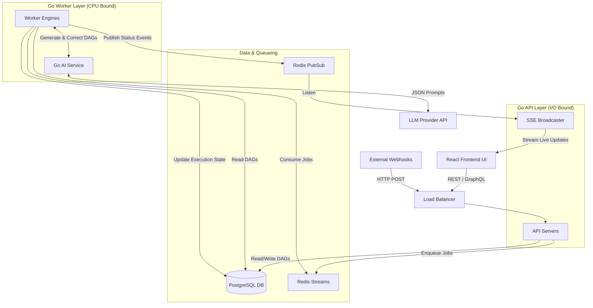

# Project Requirements Document (PRD): FlowForge

## 1. Executive Summary

**Project Name:** FlowForge
**Vision:** To build a highly scalable, self-hosted workflow automation platform capable of competing with Zapier and n8n. FlowForge empowers teams to define, execute, monitor, and collaborate on automated workflows. It distinguishes itself by seamlessly blending robust deterministic execution (DAGs) with native AI agents for workflow generation and automated debugging, all secured within an enterprise-grade multi-tenant architecture.

## 2. Target Audience & User Roles

The platform enforces strict Role-Based Access Control (RBAC) at the workspace (tenant) level to ensure operational security.

- **Admin (Workspace Owner):** Full administrative privileges. Can invite/remove users, configure global workspace variables and OAuth connections (Credential Vault), and manage all workflows.
- **Editor (Workflow Builder):** The active developer role. Can create, edit, delete, and manually trigger workflows. Can perform Local Step Testing and view execution logs for debugging. Cannot manage workspace settings or users.
- **Viewer (Read-Only):** Stakeholders or support staff. Can view workflow configurations (DAG), execution histories, and logs to investigate issues. Cannot modify workflows or trigger runs.

## 3. Core Features

To provide a premium automation experience, FlowForge includes the following core capabilities:

- **AI-Powered Natural Language Builder:** Generate complex workflow DAGs simply by describing the desired outcome in plain English.
- **Intelligent Diagnostics:** Automated AI analysis of step failures, providing plain-English explanations and actionable fixes.
- **Data Interpolation Engine:** Robust dynamic variable injection (e.g., via Go Templates or JSONata) allowing downstream steps to easily reference outputs from upstream steps (e.g., `{{ step_A.user.email }}`).
- **Advanced Control Flow:** Support for logical routing nodes, including Conditional Branching (`Switch/Case`) and Iteration (`Loop/ForEach`).
- **Credential Vault:** Centralized, encrypted storage for OAuth tokens and API keys, preventing hardcoded secrets within individual workflow steps.
- **Stateful Webhooks (Wait for Event):** The ability for a workflow to pause execution and "sleep" indefinitely until an external webhook event wakes it up.
- **Local Step Testing (Dry Runs):** Builders can execute and test a single node in isolation during the configuration phase to fetch real sample data.

## 4. Architecture & Design Patterns

FlowForge utilizes a decoupled, asynchronously driven backend designed for high throughput and fault tolerance.

### 4.1 High-Level Architecture Diagram

- \*\*Monorepo Deployment (Single Binary Advantage): The system is entirely Go-based, compiling into distinct, lightweight binaries/containers for API and Worker functions without requiring external sidecar services for AI.

  \*API Layer (I/O Bound): Manages REST/GraphQL traffic, RBAC, Webhooks, and streams real-time state to the UI via Server-Sent Events (SSE).

  \*Worker Layer (CPU Bound): Consumes jobs, executes workflow steps, and evaluates DAG logic.

- \*\*Event-Driven Communication: Redis acts as the central nervous system, handling job queues and PubSub broadcasting.

### 4.2 Architectural Breakdown

- **Monorepo Deployment (Single Binary Advantage):** The system is entirely Go-based, compiling into distinct, lightweight binaries/containers for API and Worker functions without requiring external sidecar services for AI.
  - **API Layer (I/O Bound):** Manages REST/GraphQL traffic, RBAC, Webhooks, and streams real-time state to the UI via Server-Sent Events (SSE).
  - **Worker Layer (CPU Bound):** Consumes jobs, executes workflow steps, and evaluates DAG logic.
- **Event-Driven Communication:** Redis acts as the central nervous system, handling job queues and PubSub broadcasting.

### 4.3 Key Software Design Patterns

- **The Strategy Pattern:** Step execution logic is strictly abstracted. The core engine calls a generic `StepExecutor` interface, allowing new step types (HTTP, Script, Delay) to be added without modifying the engine's traversal logic.
- **Worker Pool Pattern:** Concurrency is managed via bounded worker pools. Go `goroutines` are limited to a fixed capacity per pod to prevent memory exhaustion during massive traffic spikes.
- **The Saga Pattern (Compensating Transactions):** For workflows bridging multiple external APIs, the system supports "Compensation Steps." If a workflow fails midway, compensation tasks run automatically to roll back or clean up upstream actions.

## 5. Technology Stack

- **Backend Application:** Go (Golang)
- **Frontend UI:** React (TypeScript) leveraging **React Flow** for interactive, drag-and-drop DAG rendering and manipulation.
- **Primary Database:** PostgreSQL. Utilizing **JSONB** and GIN indexes for flexible payload storage, and native **Table Partitioning** (by month) for the high-volume `step_executions` log table.
- **Message Broker & Cache:** Redis. Specifically utilizing **Redis Streams** with Consumer Groups for exactly-once job delivery, and Redis PubSub for SSE event bridging.
- **Native AI Integration:** **Go (`langchaingo` or Google Gen AI SDK)**. The AI service is embedded directly into the Go backend. This ensures the prompt formatting, JSON schema validation, and self-correction loops execute with minimal latency and without the memory overhead of a separate Python or Rust microservice.

## 6. Functional Requirements

### Epic 1: Workflow Engine & DAG Execution

- **REQ-1.1:** The engine must parse and validate workflow DAGs using Kahn's Algorithm, explicitly rejecting circular dependencies.
- **REQ-1.2:** The engine must execute independent branches of the DAG concurrently and dependent nodes sequentially.
- **REQ-1.3:** Execution must be idempotent. External network calls must generate and utilize `Idempotency-Key` headers to prevent duplicate data mutations during transient network retries.

### Epic 2: API & Trigger Management

- **REQ-2.1:** Workflows must support three trigger types: Manual API call, authenticated Webhook, and Scheduled (Cron).
- **REQ-2.2:** Cron schedulers must utilize Redis distributed locks (`SETNX`) to prevent duplicate job enqueueing across horizontally scaled API pods.
- **REQ-2.3:** The API must implement pagination, filtering, rate-limiting, and strict RBAC enforcement on all endpoints.

### Epic 3: User Interface & Real-Time Monitoring

- **REQ-3.1:** The frontend must render the DAG visually and allow users to configure step inputs via forms.
- **REQ-3.2:** The UI must display live execution status using Server-Sent Events (SSE), with nodes visually changing color in real-time.

### Epic 4: AI Agent Integration (Native Go)

- **REQ-4.1:** The native Go AI service must accept natural language and enforce structured JSON DAG outputs from the LLM provider.
- **REQ-4.2:** The system must implement an automated self-correction loop in Go: if the DAG parser detects an error (e.g., cycle detected), the Go service immediately queries the LLM to correct the JSON payload without failing the user request (max 3 retries).

## 7. Non-Functional Requirements

- **Multi-Tenant Isolation:** The database must use a Shared Database/Shared Schema approach, with Postgres Row-Level Security (RLS) enforcing strict `tenant_id` boundaries.
- **Test-Driven Development (TDD):** Core engine packages and AI validation loops must be written test-first, maintaining a minimum 80% test coverage.
- **Scalability:** API and Worker containers must be completely stateless (aside from Redis/DB connections) to allow seamless horizontal scaling.

## 8. Out of Scope (Deferred to Future Phases)

- **Phase 2:** Migrating inter-service JSON payloads to binary Protocol Buffers (Protobuf) for extreme high-throughput efficiency.
- **Phase 2:** Implementing PostgreSQL Tablespaces to physically isolate heavy log writing from core application reads.
- **Phase 2:** Executing custom user scripts in strictly isolated WebAssembly (Wasm) sandboxes using `wazero`.
- **Phase 2:** Implementing OpenTelemetry for deep distributed tracing across the API, queue, and workers.
